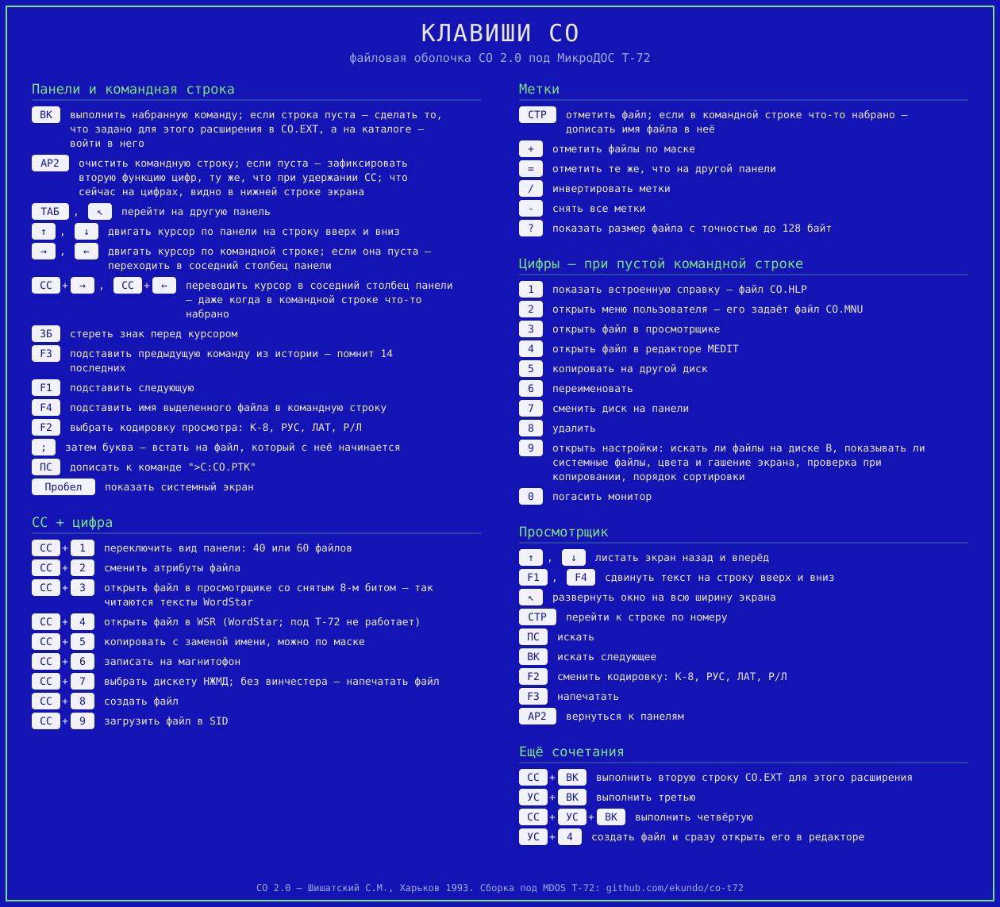

# CO под MDOS T-72

Файловый менеджер **CO v2.0** (Шишатский С.М., Харьков, 1993) написан под ОС **T-34** и ни
под какой другой не запускался. Здесь он доведён до работы под
[MDOS T-72](https://github.com/ImproverX/MDOS_T-72) — со всеми дисками: квазидиск, оба
флоповода, винчестер.

Встроенная справка — [`docs/co-help.md`](docs/co-help.md): тот же текст, что CO
показывает по клавише «1», и из него же собирается `CO.HLP`. Всё то же самое
одной картинкой — карточка клавиш ниже, её рисует [`tools/keycard.py`](tools/keycard.py).



## Скачать

Готовые сборки — во [вкладке Releases](../../releases), по одной на каждую сборку T-72:

| сборка | МикроДОС | оборудование |
|---|---|---|
| `co-t72f.zip` `.fdd` `.edd` | `os-t72f.rom` | два НГМД и два квазидиска |
| `co-t72h.zip` `.fdd` `.edd` | `os-t72h.rom` | НЖМД и два квазидиска, без НГМД |
| `co-t72hx.zip` `.fdd` `.edd` | `os-t72hx.rom` | всё оборудование |
| `co-t72k.zip` `.fdd` `.edd` | `os-t72k.rom` | только квазидиски |
| `vde-t72.zip` | любая | редактор [VDE](vde/README.md) сам по себе, без CO |

На каждую сборку три файла. В `.zip` — `CO.COM` с комплектом, `HDIR.COM`
(и `HDIREN.COM` — то же по-английски), редактор `VDE.COM` с авторской
документацией, сама МикроДОС и `README.txt`.

`.fdd` и `.edd` — готовые рабочие диски, а не голый комплект CO: в них лежит
весь софт, на который ссылаются сам `CO.COM`, `CO.MNU` и `CO.EXT`, — редактор
`MEDIT`, отладчик `SID`, `RUND`, `KOD`, `SYSGEN`, `GO`, загрузчики на
магнитофон `SAVE*.COM` и архиватор `ARC2.COM` с показательным архивом
`DEMO.PK2`. Кроме WordStar (`WSR.COM`): он заточен под КОИ-7 и под
T-72 толком не работает, и на клавише «СС»-«4» вместо него теперь
[`VDE`](vde/README.md) — тот же набор команд WordStar, но переведённый с Z80 на
8080 и работающий в КОИ-8. Собираются образы не с нуля: за основу
берётся рабочий диск, а сборка заменяет в нём ровно то, что относится к ней
самой, — `OS.COM` под нужную сборку T-72, `CO.COM`, `CO.HLP` и `HDIR.COM`,
а дискете ещё и системные дорожки.

Квазидиск поднимает CO сам; дискета — тоже, но только на сборках `f` и `hx`:
на `h` и `k` драйвера дисковода нет, и система с дискеты автозапуск не ищет.

Сама МикроДОС (`os-t72X.rom` — формат, который понимает загрузчик Вектора) —
сборка ImproverX от 17.09.2026, она же лежит в [`t72/`](t72/). Именно её, а не сборку из репозитория T-72: таблицу состава
оборудования ImproverX завёл позже исходников, и на старой системе CO не
показывает номер дискеты НЖМД и не знает конфигурации Вектора.

Все проверены в эмуляторе: панели, выбор дискеты НЖМД по СС+7, номер и метка
в рамке. У сборки `f` диск A: — настоящий НГМД, и с пустым дисководом CO покажет
на нём ошибку чтения; это обычное поведение, а не ограничение сборки.

Сборка `k` (только квазидиски) раньше в выпуск не входила: CO предлагал в меню
`A:` и `B:` там, где дисковода в системе нет вовсе. Теперь состав оборудования он
спрашивает у самой системы при старте и лишние диски не показывает — см. ниже.

Проверять `k` и `h` надо в Emu80: обе сборки T-72 идут без драйверов флоповодов,
диски `A:` и `B:` у них — дискеты винчестера, а v06x винчестера не эмулирует и
падает на первом же обращении к нему. Сама ОС под ними поднимается, и CO
доходит до конца пусковой цепочки — дальше упирается в стенд, а не в сборку.

```sh
v06x --rom os-t72f.rom --fdd co-t72f.fdd --edd co-t72f.edd
```

**`CO.COM` один на все сборки** — двоичный файл совпадает побайтно. Зашитых адресов
ОС в нём не осталось: адрес дискового обработчика БСВВ он берёт при старте из
вектора `E213`, адрес таблицы дискет НЖМД — из таблицы состава оборудования по
`FFCC`. Сборки различаются только МикроДОС и готовыми образами дискеты
и квазидиска.

На T-72 старше 15.09.2026 таблицы состава оборудования нет, и тот же `CO.COM`
работает по-старому: в меню `A:`, `B:` и `C:`, диск `D:` не предлагается, `СС+7`
остаётся выбором дискеты НЖМД. Пропадает только номер и метка дискеты в рамке
панели — её адрес брать неоткуда. Проверено на старых `os-t72f` и `os-t72hx`:
по `FFC9` там ноль, обе пробы отваливаются на первой же проверке, прогон по
функциям 40 из 40.

## Что сделано

| | |
|---|---|
| Стек ниже `BC00` | Главная причина. T-72 держит килобайтный буфер дисковода на `BC00`, а вершину TPA в ячейке `0006` не опустил — она сообщает `C000`. CO ставит стек по правилам CP/M, и каждое чтение сектора затирало его вместе с адресами возврата. Дефект T-72, а не CO: под удар попадает любая корректная программа. |
| Адрес обработчика БСВВ | Единственный зашитый адрес ОС во всём CO. Снимается с живого Вектора: в таблице по `E212` он появляется только после первого обращения к диску, до этого там заглушка. |
| Заставка | Была в КОИ-7 и переключалась кодом `0Eh`, которого у T-72 нет. Переведена в КОИ-8, текст свой. |
| Файлы, кратные 16 КБ | CO их не показывал: пропускал полные экстенты как продолжение файла, а у такого файла полны все. Дубли ищутся по всему списку — двух одинаковых строк сортировка CO не переживает. |
| Квазидисковая проба | Переключала банк с разрешёнными прерываниями. Прилетело прерывание — и Вектор исполняет содержимое банка вместо БСВВ. Закрыто `DI`/`EI`. |
| СС+7 — выбор дискеты НЖМД | Вместо печати файла — но только если винчестер в Векторе есть; иначе на клавише остаётся штатная печать. Спрашивает номер, выполняет команду МикроДОС «9», перечитывает панель. Номер запоминается в `CO.HDD` и применяется при следующем запуске; защита этого файла от записи фиксирует выбор как умолчание. Без НЖМД пусковое восстановление выключается совсем: команда «9» обращается к диску, и на Векторе без НГМД это кончалось ошибкой диска ещё до панелей. |
| Кодировки в просмотрщике | Меню «F2» переключало набор знакогенератора командами T-34: байты `0Eh`/`0Fh` и `ESC [`. У T-72 таких кодов нет вовсе, из четырёх режимов работал один, и тот не так. Основной набор её консоли — КОИ-8, поэтому CO перекодирует сам перед выводом знака: РУС, ЛАТ, Р/Л и К-8 ведут себя как на T-34. Переключение набора в системе — при запуске программ, при выборе пункта `CO.MNU` и буквами в `CO.EXT` — выпилено: подставить там нечего. |
| Пустышки из `CO.ZGR` | При первом запуске CO переносил на `C:` файлы из списка, заводя запись нулевой длины и для тех, которых на исходном диске нет. Теперь строка принимается, только если файл открывается. |
| Номер дискеты и метка в рамке панели | Вывороткой в верхнем крае рамки, у правого края: в шапке места нет — она ровно на сорок знаков, а панелей две, а в нижнем крае надпись затирал счётчик отмеченных файлов. Колонки, по которым панель прочерчивает вертикальные разделители, полоса перешагивает знаком «вправо» — печать любого знака стёрла бы штрих, и разделитель перестал бы примыкать к рамке; под самой надписью разделитель, наоборот, закрывается. Номер берётся из таблицы дискет ОС, поэтому верен и когда дискету назначили командой «9» мимо CO; метка читается с самой дискеты (её пишет `HDIR /M`). |
| «СТР» в просмотрщике у начала файла | Переход к строке начинался с отката на 13h строк назад, а откат (`32C3`) подкачивал предыдущую запись файла, не глядя, есть ли она. У начала номер записи уходил в минус, чтение возвращало пустоту, буфер набивался знаками конца текста — и перевода строки в нём не находилось уже никогда. CO вис намертво; на файле короче страницы это ловилось с первого нажатия. Дефект самого CO, не порта: в двух других местах (`318E`, `31C5`) он от этого бережётся, а здесь проверки нет. |
| Запуск с диска `B:` | При старте CO смотрит, с какого диска её запустили, и если не с `C:` — переносит на `C:` файлы из списка `CO.ZGR`. «Не `C:`» — это и `B:`, а каталог диска `B:` CO держит копией в ОЗУ по `4000-4FFF`, где лежит её собственный пусковой код: заставка, проба оборудования, проверка `CO.ZGR`, переносчик накладок. Перенос читает каталог стартового диска — и ОС кладёт его ровно поверх работающего кода. На экране это заставка и синий экран навсегда; поймать легко — ВК на `CO.COM`, когда панель открыта на `B:`. Перенос теперь делается только при запуске с `A:`, как и написано в описании `CO.ZGR`. |
| Длинные `CO.EXT` и `CO.MNU` | Списки CO читает целиком и без предела — в окно, с `A000`. А с `A448` в окне лежат накладки сборки: обмен через буфер вне окна, склейка экстентов, поиск программы по дискам, кодировки просмотрщика. Значит `CO.MNU` длиннее `448h` байт ложится прямо на них, и первое же обращение к диску уходит в мусор. Проверено: на файле в три килобайта сторож ловит запись в `A48F` из БДОС. Чтение уведено в буфер копирования, на `6100`; `CO.ZGR` остался в окне — его список разбирается, пока идёт перенос файлов, а перенос как раз и работает через этот буфер. |
| Меню пользователя длиннее двух десятков пунктов | Размер таблицы меню по `B728` в CO указан трижды и все три раза по-разному: `39DA` чистит `2Eh` байт (23 пункта), `3A46` перебирает `1Ah` записей (26), а `3A1C` заполняет, пока идут строки `CO.MNU`, — без всякого предела. Тридцать пунктов записывают шестьдесят байт, до `B763`, а с `B75C` начинается дописанный сборкой код, первым там обмен с диском `D:`. Поймано сторожем: `ЗАТЁРТ_B75C_из_3A1F`. Теперь заполнение останавливается по краю таблицы — на двадцать шестом пункте, ровно там, докуда достаёт перебор самой CO. |
| «СС»-«4» — редактор VDE | На этой клавише у CO стоял WordStar (`WSR.COM`), а он заточен под КОИ-7: под T-72 в нём не читается и не набирается русский. Вместо него в выпуске [`VDE`](vde/README.md) — редактор Эрика Мейера с тем же набором команд WordStar, переведённый с Z80 на 8080 и работающий в КОИ-8. Имена запускаемых программ лежат в CO таблицей по 12 байт, длина у `VDE` та же, что у `WSR`, — меняется только имя и подпись в нижней строке (`tools/wsr2vde.py`). Без редактора рядом правка не делается: указывать клавишей на файл, которого в комплекте нет, незачем. |
| Нижняя строка подсказки | Обе строки — обычная и по «СС» — были на 79 знаков при ширине экрана в 80: полоса выворотки не доходила до рамки правой панели ровно на знакоместо, а подписи слипались — «3-Просм.4-Мedit», «2-Атриб.3-ПрК7», — пробела между ними не помещалось. Мешало и другое: напечатав знак в последней колонке, консоль T-72 переводит строку, а подсказка — последняя строка экрана, и он прокручивался (панели уезжали вверх, подсказка садилась на командную строку). Теперь перед подсказкой автоперевод выключается (`ЭСК [ 7 l`), а когда CO отдаёт экран командной строке — включается обратно: дальше там работают ССР и чужие программы. Место под восьмидесятый знак нашлось там, где лежали строки бывшего переключателя знакогенератора (`ЭСК [` и `ЭСК \`): сам переключатель сборка давно заменила своим, а под T-72 `ЭСК [` — ещё и начало команды с параметрами, напечатанная одна она проглотила бы следующий знак. Раскладывает подписи [`tools/barline.py`](tools/barline.py), двигает строки [`tools/barwide.py`](tools/barwide.py). |
| Список переноса `CO.ZGR` | Запущенная не с `C:`, CO переносит туда свой обиход по списку из этого файла. В выпуске их было два разных: на готовой дискете список рабочего диска на два десятка имён, а в архиве — авторский на восемь, где половины файлов нет вовсе (`FORMATM.COM`), зато нет `HDIR.COM`, который есть. Теперь список один и собирается сборкой ([`tools/mkzgr.py`](tools/mkzgr.py)); редактор с краткой справкой и архиватор в нём тоже есть. |
| Архиватор и показательный архив | Смотреть `.PK2` и распаковывать из них CO умеет сама, но распаковку отдаёт архиватору — «ARCHIVER V1.3 (C) V.KRUPSKY 1990». Его в выпуске не было, и показать эту работу было не на чем. Теперь на обоих дисках лежат `ARC2.COM` и `DEMO.PK2` на два файла: «3-Просм» на архиве открывает его каталог, ВК на строке — распаковывает. Архив настоящий, поддельный ARC2 не распакует: сжатие у него своё. Поэтому и собирается он самим ARC2 в эмуляторе — разговор с ним расписан по шагам в [`tools/mkdemo.sh`](tools/mkdemo.sh). |
| Мусор на экране после просмотра архива | Выйти из списка `.PK2` по «АР2» — и половина экрана с панелью забита случайными знаками; не лечится ни переходом на соседнюю панель, ни повторным просмотром. Данные целы, испорчена только картинка: CO держит её копией в буфере копирования и оттуда возвращает на экран (`0415`, по четверти буфера на половину экрана). А сборка с 2.2.2 читает туда же каталог архива — в окне ОЗУ ему места не осталось, там накладки. Вернуть каталог в окно нельзя: ему нужно два килобайта подряд, а свободно там полторы сотни байт. Поэтому выход из списка больше не возвращает картинку, а рисует панель заново — из списка, который никуда не девался (правка по `2DC3` в [листинге](co-src/co.asm)). Девять байт на месте, диск при этом не читается. |

Дописанный код лежит в хвосте образа, а работает по `B740` — при старте копируется туда
стабом: область по `4100` при загрузке занимает сам образ, и код там затирается.
Не с `B700`, как было сначала: у CO по `B6A8` буфер строки на 128 байт, он достаёт
до `B727`, и ещё одна его переменная лежит по `B73C`. Под стеком тесно — от `B740` до
буфера дисковода ОС на `BC00` всего 1216 байт, — поэтому надпись в рамке туда не
едет вовсе: её тело остаётся там, куда его положила загрузка, и копировщик при
старте переносит его на `A600`, а `relocstub.py` получает границу переноса ключом
`--keep`.

Тело надписи остаётся там, куда его положила загрузка, а под стек едет только
копировщик: места там 1216 байт, и триста из них на тело — непозволительная
роскошь. К моменту копирования исходник ещё цел, каталог читается в ту же
область позже.

По адресу загрузки остаётся и всё, что дописано после надписи, — но постоянному
коду там не место: каталог диска `B:` CO держит копией в ОЗУ по `4000`, и она
накрывает `4000-4FFF` целиком. Пусковым накладкам (проба оборудования, проверка
`CO.ZGR`) это безразлично — они своё делают до первого чтения каталога.
Постоянным — нет: обмен через буфер вне окна, поиск программы по дискам и
кодировки просмотрщика затирало открытие панели `B:` прямо посреди работы.
Поэтому они собираются на адрес в самом окне, `A448`, и переносчик кладёт их
туда при старте (`tools/winmove.py`). Свободные куски окна найдены слежением за
записью: ни просмотр файла с прокруткой, ни копирование, ни смена дисков в
`A448-A5FF` не пишут. Код в окне живёт спокойно: окно выключается только на
время самой пересылки с `D:`, а накладки в этот момент не исполняются.

Буферы самого CO остаются в окне `A000-DFFF`: свободной памяти ниже `A000` нет.
Каталог диска с большим оглавлением (у дискеты НЖМД их 128) читается в `4100` и
достаёт до `4BFF`, дальше `5000-5FFF` — ещё один каталожный буфер, а `6000-9FFF`
занято буфером копирования. Проверено на живом Векторе: при открытом `B:`,
назначенном на дискету винта, по этим адресам лежат записи каталога. Перенос
буферов на `4800` поэтому и отменён: он работал ровно до первого такого диска.

Диску D: это мешало, и сильно. Драйвер на время обмена со вторым квазидиском
гасит первый целиком, вместе с окном ОЗУ, — README самой T-72 говорит об этом
прямо: адрес буфера дисковой операции не должен попадать в `0A000h..0DFFFh`.
Буфер в этом окне обменивается данными с видеопамятью: чтение оставляет буфер
нетронутым и рисует сектор полосой на экране, запись кладёт на диск экран.
Буферы остались там, где были, а сам обмен переведён на штатный буфер CP/M по
`0080` с досылкой в настоящий — врезок двенадцать, пять через БДОС и семь на
прямых вызовах секторных подпрограмм БСВВ, мимо которых у CO ходит быстрый путь.

## Диск D: — второй квазидиск

Входит в сборку всегда: пункт «D» в меню появляется, только если система о
втором квазидиске знает, а на Векторе с одним он просто не показывается.

Мешало пять вещей, все в CO и все нашлись только трассировкой каждого обращения
к БСВВ.

| | |
|---|---|
| Фильтр пропускал один квазидиск | CO перехватывает вектор дисковых операций и по `0185` смотрит на номер диска: двойка уходит к БСВВ сразу, остальное идёт по собственному пути CO, рассчитанному на дисководы. Диск 3 проваливался туда же, и обмен с ним шёл мимо БСВВ. `JZ` заменён на `JNC` — один байт, и к БСВВ идут оба квазидиска, а дисководы 0 и 1 как раньше. |
| Каталог читался и писался по разной разметке | По `0B5C` и `0B6B` CO выбирает не разметку, а сами подпрограммы доступа: для `C:` квазидисковые, для всего прочего дисководные, у которых каталог на 128 входов и лежит с дорожки 8. Выходило, что каталог `D:` читается с дорожки 0 шестнадцатью записями, а пишется тридцатью двумя с дорожки 8. После такой записи контрольные суммы на дорожке 0 перестают сходиться с данными, и следующее чтение даёт `ST=02`. Обе проверки уведены в ветку `C:`. |
| Копирование теряло 4 КБ в середине файла | Та же проверка буквы диска, третья по счёту: подпрограмма по `027A` держит копию каталога дискеты в памяти и сбрасывает её на диск залпом в 4 КБ — каталог дискеты на 128 записей. Для квазидиска она не нужна и сразу выходит, но `D:` под проверку не попадал, и CO шёл дискетной веткой, заливая нулями блоки 8..11 только что записанного файла. |
| Обмен шёл через буфер в окне | Просмотрщик читал файл прямо в `A000-DFFF`, `CO.PRM` писался с `A000`, а буфер копирования упирался в `A000` последними двумя записями — на файлах от 16 КБ они уезжали нулями. Весь дисковый обмен переведён на буфер по `0080` с досылкой. |
| Поиск программы по дискам не знал о `D:` | Не найдя программу на текущем диске, CO перебирает `C:`, `A:` и `B:` — так написано и в справке. Второго квазидиска в переборе не было, и программа, лежащая только на `D:`, не находилась вовсе. Врезка по `104D`: сперва пробуем `D:`, если проба оборудования его нашла. |

Проверено на стенде: панель `D:` открывается, весь комплект `C:` копируется на
пустой `D:` целиком — восемь файлов, ни одной ошибки, все 32 записи первых
четырёх дорожек сходятся с контрольными суммами.

Пустой образ второго квазидиска делает `tools/kdimg.py format`: он пишет по
сто двадцать восемь байт `0E5h` в каждую запись и считает контрольные суммы —
то же, что делает команда ОС «8 D: F». Нулевой образ не годится: по суммам он
сходится, но каталог из нулей для CP/M не пуст — нулевой первый байт записи
значит «занято, пользователь 0».

## HDIR — каталог винчестера

Отдельная программа под T-72: печатает каталоги «дискет» НЖМД и ищет файл сразу по
всему винчестеру, не переназначая дискеты на `A:` и `B:`.

```
HDIR              подсказка
HDIR *.*          каталоги всех дискет, на которых что-то есть
HDIR 5            каталог дискеты 5 (номер 16-ричный, как в команде «9»)
HDIR 5-1F 40      дискеты 5..1F и 40
HDIR *.COM        поиск по всем дискетам
HDIR 10-20 DIZ*   поиск на дискетах 10..20
HDIR /L           список меток: номер и метка, только там, где метка есть
HDIR /X 5 9       поменять дискеты 5 и 9 местами
HDIR /Z 5         очистить дискету 5
HDIR /M 5 ИГРЫ    метка дискеты 5, до 32 знаков
HDIR /M 5         то же, но текст спросит отдельно (сохранит строчные)
HDIR /N           без остановок на каждой странице
HDIR ?            подсказка
```

Слово с «.», «*» или «?» — шаблон, остальные слова — номера дискет. Вывод
постраничный, АР2 прекращает. При выводе в файл (`HDIR *.COM >SPISOK.TXT`)
остановки снимаются сами: `>` разбирает ПКК, и программа смотрит на его признак
перенаправления — иначе подсказка «Нажмите клавишу» попала бы в файл.

Обмен и очистка спрашивают подтверждение. Обмен переливает все 622h секторов
туда и обратно — переставить дискеты записью в таблицу нельзя, номер дискеты и
есть её место на диске, БСВВ считает адрес прямо из него. Это около минуты на
пару и прерывать это нечем: на середине остались бы две полудискеты. Очистка
пишет пустой каталог, файлы физически остаются лежать — ровно как при разметке
дискеты.

Текст метки, набранный в командной строке, всегда выходит заглавными: ПКК
МикроДОС приводит к ним всю строку ещё до запуска программы. Поэтому `HDIR /M 5`
без текста спрашивает его отдельно — ввод идёт через БДОС, а он регистр не
трогает. Пустой ответ снимает метку.

Метка живёт в самой дискете и переезжает вместе с ней при обмене. Место нашлось
своё: файловая система занимает 392 блока по 2 КБ, это 1568 секторов из 1570, а
последние два не принадлежат никому — их нет в таблице блоков, и БДОС туда не
пишет. Система метку не видит, показывает её только HDIR — в конце строки с
номером дискеты.

После обмена и очистки программа сбрасывает дисковую подсистему, но если
дискета была назначена на `A:` или `B:`, надёжнее назначить её заново.

Число дискет не зашито: программа читает заголовок винчестера — оттуда же его
берёт при старте и сама система, — поэтому на диске другого размера покажет
столько дискет, сколько там размечено.

НЖМД читается напрямую портами, теми же и в том же порядке, что и БСВВ, — поэтому
одна сборка годится для любой сборки T-72. Адрес ОС в программе всё же один: байт `E10E`,
которым ПКК помечает перенаправление вывода в файл. Он общий у трёх сборок, на которых
это смотрели (у `k` не проверяли), потому что БДОС у них один и тот же; переедет —
HDIR просто начнёт останавливаться на страницах при выводе в файл, и это снимается
ключом `/N`.

Код общий, различаются только сообщения:

```sh
python3 tools/asm8080.py tools/hdir.asm    -o out/HDIR.COM   # по-русски
python3 tools/asm8080.py tools/hdir-en.asm -o out/HDIR.COM   # english
```

## Собрать самому

```sh
./vde/fetch-src.sh             # один раз: авторский исходник VDE в work/
./patch-co.sh work/co/co.com work/os-t72/os-t72.edd out/ t72/os-t72f.rom work/vde/VDE.COM
./make-release.sh work/co/co.com work/os-t72/os-t72.edd release/   # все четыре сборки
./check.sh out/CO.COM          # прогон по трём конфигурациям
./check-funcs.sh out/          # прогон по функциям CO
./deploy-fdd.sh                # выложить бинари на рабочую дискету
```

Пятый аргумент `patch-co.sh` — `VDE.COM`; без него правка «СС»-«4» не делается
и редактор в образы не кладётся. Собирает его `vde/build.sh` из авторского
исходника, которого в репозитории нет (`vde/fetch-src.sh` его добывает).

Правки, которые ложатся на место байт в байт, живут в самом листинге
[`co-src/co.asm`](co-src/co.asm) — каждая помечена словом «ПРАВКА» и объяснена
на месте. Сверяет их [`check-src.sh`](check-src.sh): листинг собирается и
сравнивается с подлинным образом, и **всякое** расхождение обязано лежать
внутри помеченной строки. Изменил что-то молча — сборка остановится и покажет
адрес. В `tools/` остаётся то, что дописывает код: накладки, переносчик,
врезки.

`check-funcs.sh` гоняет CO по его клавишам и меряет каждую четырьмя мерками:
попал ли адрес обработчика из таблиц `05DB`/`0638` в карту исполнения — то есть
функция действительно отработала, а не нажатие ушло в пустоту; не легло ли при
этом что-нибудь в подэкранную область `A000-DFFF`; цел ли дописанный сборкой
код (адреса берутся из `layout.txt`, за стек отвечает сторож в самом
эмуляторе); и не завелось ли в списке панели двух строк с одним именем.
Восемьдесят восемь сценариев, от стрелок до копирования, распаковки архива и
правки командной строки; по `DRIVE=D` и `DRIVE=B` те же сценарии гоняются с
панелью на втором квазидиске и на дискете. В шапке скрипта записана раскладка
клавиш Вектора, снятая на нём же.

Одна проверка смотрит не в память, а на экран: выход из списка архива должен
вернуть панель ровно такой, какой она была. Сценарий прогоняется дважды — до
открытия архива и после выхода, — и кадры сравниваются
([`tools/pngsame.py`](tools/pngsame.py), нижние строки не в счёт). Испорченная
картинка панели в памяти никак не видна, и поймать её больше нечем.

Где в памяти свободно, сборка не меряет, а выводит:
[`tools/winholes.py`](tools/winholes.py) перечисляет по листингу все адреса,
которые CO вообще называет, раскладывает их по описанным областям и отдаёт то,
что не покрыто ничем. Если CO называет адрес, которого нет в карте, сборка
останавливается — значит карта неполна. Отдельной строкой идут адреса,
собранные из половинок (`MVI H,9Fh`): поиском шестнадцатибитных констант их не
видно, а на одном из них мы уже обожглись.

Чем эти сценарии задевают сам CO, показывают [`tools/covmap.py`](tools/covmap.py)
(по подпрограммам листинга) и [`tools/covruns.py`](tools/covruns.py) (сплошными
кусками): `COVDIR=cov ./check-funcs.sh out/` снимает карты, дальше
`./tools/covmap.py cov`. Считается по командам, а не по байтам: карта отмечает
только первый байт команды. Сейчас — 83% команд листинга.

В счёт идут не все карты: сценарии, поднимающие чужую программу — запуск
файла, пункт `CO.MNU`, распаковка архива, `HDIR`, редактор, — ложатся
подкаталогом `чужие/`. Чужая программа грузится по тем же `0100` и работает в
тех же адресах, что и CO, и в карте её след от следа CO не отличить: с ними
выходило бы 90%, то есть на 485 команд больше, чем CO исполнила.

Нужны: исходный `co.com` с комплектом, подлинный `os-t72.edd` как основа, МикроДОС
из [`t72/`](t72/) и три клона в `tools/` — [MDOS_T-72](https://github.com/ImproverX/MDOS_T-72)
(за исходниками; собранные образы для выпуска берутся не оттуда),
[v06x](https://github.com/svofski/vector06sdl) (`./build-v06x.sh`) и
[Emu80](https://github.com/vpyk/emu80v4) (`./build-emu80.sh`).

Винчестер подлинный v06x не эмулирует, поэтому в клон дописан: регистры ATA на
портах `50h..58h`, образ ключом `--hdd` (`tools/v06x-instrumentation.patch`,
`src/hdd.h`). Образ для проверок собирает [`tools/mkhdd.py`](tools/mkhdd.py) --
дискеты НЖМД, файлы на них и метки. Так под стенд попали и выбор дискеты по
`СС+7`, и `HDIR`; раньше это проверялось только в Emu80 и только руками.

Инструменты в `tools/`: сборка образов дискет и квазидиска, ассемблер и дизассемблер
8080 (таблица команд у них общая), правка зашитых адресов, перекодировка; каждая
правка CO — отдельным файлом с разбором в шапке.
Стенд — пропатченный v06x (`patches/v06x-instrumentation.diff`): трассировка по диапазону PC
с кольцевым буфером, карта исполненных адресов, обращения к памяти с состоянием банка,
выгрузка квазидиска и снимок состояния по горячей клавише.

## Происхождение и лицензии

- **CO v2.0** — Шишатский С.М., Харьков, 1993. Здесь только правки к нему и инструменты
  сборки; сам менеджер принадлежит автору. Исходные файлы — в каталоге программ
  [Базис](https://caglrc.cc/scalar/ware/791/).
- **MDOS T-72** — [ImproverX](https://github.com/ImproverX/MDOS_T-72), GPLv3; образы системы в архивах
  распространяется по этой лицензии, исходники — в его репозитории. Отдельное спасибо ему
  за разобранные и выложенные исходники — и самой системы, и CO: без них искать в T-72
  адрес дискового обработчика, а в CO место, где пропускаются полные экстенты, пришлось бы
  вслепую.
- **VDE 2.67b** — Эрик Мейер, 1988; редактор принадлежит автору, здесь только
  перевод с Z80 на 8080 и правки под T-72. Авторского исходника в репозитории
  нет намеренно — см. [`vde/README.md`](vde/README.md); в архивах выпуска лежит
  собранный `VDE.COM` и авторская документация из его же выпуска 2.66.
- **Софт на готовых дисках** — то, на что ссылаются `CO.MNU` и `CO.EXT`:
  `MEDIT`, `SID`, `RUND`, `KOD`, `SYSGEN`, `GO`, `SAVE*.COM` и архиватор
  `ARC2.COM` («ARCHIVER V1.3 (C) V.KRUPSKY 1990»). Всё это чужое и лежит в
  образах в том виде, в каком было на рабочем диске; в репозитории его нет.
- **v06x** — [svofski](https://github.com/svofski/vector06sdl), правки для стенда лежат
  отдельным диффом.
- Всё моё — под MIT, см. `LICENSE`.
