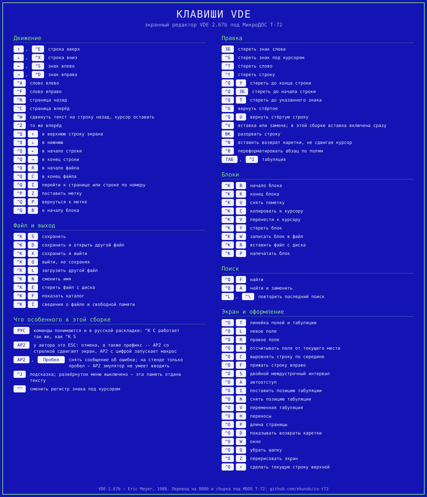

# VDE на Векторе

Экранный редактор **VDE 2.67b** (Эрик Мейер, 1988) — маленький, быстрый, с
клавишами WordStar — доведён до работы под МикроДОС T-72 на Векторе-06Ц.

Главное препятствие: VDE написана на Z80, а у Вектора КР580ВМ80А — чистый 8080.
Готовый `VDE.COM` на нём не запускается в принципе, и не по недосмотру: Мейер
поставил в самое начало программу проверку процессора.

```
Start:	SUB	A		;check for Z80
	RET	PE
```

`SUB A` обнуляет A, а решает потом флаг чётности. У 8080 в этом разряде паритет
— у нуля он чётный, признак взведён, и `RET PE` возвращает управление системе. У
Z80 в том же разряде переполнение, оно сброшено, и программа идёт дальше.

Поэтому здесь не настройка готового двоичного файла, а перевод исходника на
систему команд 8080.

Клавиши — карточкой, её рисует [`keycard.py`](keycard.py) той же машинкой, что
и карточку CO. Сверена с авторской краткой справкой `VDE266.QRF` из выпуска, а
где справка и код расходятся — по коду: в справке `^Q` со стрелками расписан
задом наперёд, начало и конец строки перепутаны (`QuikLf` — «move left to start
of line»):



## Как собрать

```sh
vde/fetch-src.sh    # один раз: добыть авторский исходник
vde/build.sh        # собрать work/vde/VDE.COM
```

Авторского исходника в репозитории нет: Мейер публично говорил, что согласия на
публикацию своего кода не давал. `fetch-src.sh` берёт `vde267sc.lbr` с Walnut
Creek CD и распаковывает в `work/vde/src` (каталог в `.gitignore`). В
репозитории — только своё: транслятор, правки, профиль терминала, заместители
команд.

## Что из чего

| | |
|---|---|
| [`z80to8080.py`](z80to8080.py) | Транслитератор Z80 → Intel 8080. Раскрывает условную сборку, переводит систему команд, а места, где у 8080 точного ответа нет, берёт из файла правок — и обрывается, если правки нет. |
| [`overrides.asm`](overrides.asm) | Ручные правки к машинному переводу. Девять мест на 6008 переведённых команд, каждое с обоснованием. |
| [`t72-profile.asm`](t72-profile.asm) | Профиль терминала: то, что в оригинале правила утилита VINSTALL. Её саму переносить не пришлось — вся настройка лежит данными по фиксированным адресам. |
| [`runtime.asm`](runtime.asm) | Заместители команд, которых у 8080 нет вовсе: блочные пересылки и поиск, теневой набор регистров, ячейки под IX/IY. |
| [`vde-t72.asm`](vde-t72.asm) | Верхний файл сборки: определения и порядок модулей. |

Собирается всё нашим же ассемблером [`tools/asm8080.py`](../tools/asm8080.py).

## Перевод

Из 6008 команд машинно переводится всё, кроме девяти мест. Считает и отчитывается
сам транслятор (`work/vde/report.txt`).

Механически — там, где у 8080 есть точный ответ: система команд один в один,
`JR` → `JMP`, `DJNZ` → `DCR B`/`JNZ`, 16-битные обмены с памятью через
`XCHG`/`SHLD` без потери регистров.

Обходными последовательностями — там, где ответ один на все случаи:

- **IX/IY** живут в ячейках памяти, адрес считается в HL, а старый HL на это
  время уходит на стек. Флаги и A целы, поэтому подпись человека не нужна.
  В исходнике это мелкие указатели (`(IX)`, `(IX±1)`), а не кадры, — 71 место.
- **Теневой набор** (`EXX`, `EX AF,AF'`) — обмен с ячейками памяти.
- **`BIT`** прячет A в ячейку и возвращает его командой `LDA`: она флагов не
  трогает, поэтому Z от `ANI` доживает до проверки.
- **`SET`/`RES`** флагов не ставят вовсе, поэтому A и признаки уходят на стек
  целиком.

Руками — девять мест: шесть `SBC HL,rr`, после которых читают Z (умолчание даёт
его только по старшему байту), единственный `RRD`, потолок текстового буфера и
снятая проверка процессора.

### Флаги

Отдельная забота — места, где перевод даёт не те признаки, что оставил бы Z80.
Транслятор их не просто считает, а идёт вперёд по коду до первой команды, которая
признак перебивает, и смотрит, не прочитают ли его раньше. Расхождений 125,
и после правок тех, что кто-то читает, — ноль.

Самое дорогое из найденного так — блочный поиск. У Z80 после `CPIR`/`CPDR` в
разряде чётности лежит не паритет, а признак «счётчик не исчерпан», и VDE
ветвится именно по нему в десяти местах:

```
Lp3Lf:	CPDR			;find a CR
	JP	PO,Sk4Lf	;count exhausted?
```

Этим VDE ищет начало строки. Пока заместитель признак не выставлял, редактор
печатал строку со сдвигом на знак. Выставить разом и Z по сравнению, и чётность
по счётчику обычными командами нельзя — любая, что тронет чётность, перебьёт Z,
— поэтому байт флагов правится прямо на стеке, а `POP PSW` вносит его целиком.

## T-72

Консоль подошла почти как есть: набор ESC у T-72 близок к VT52 — `ESC Y` с
прибавкой 20h, `ESC K`, `ESC J`, `ESC A/B/C/D`, `ESC H`, негатив `ESC b` и
позитив `ESC a`. Экран 80×25. Вставки и удаления строки нет, но для VDE это не
ошибка: на нулевой длине кода она уходит на полную перерисовку.

| | |
|---|---|
| Потолок текста | VDE берёт его из ячейки `0006` и отступает страницу вниз — под T-72 выходит `BFFC`. А у T-72 на `BC00` лежит килобайтный буфер дисковода, и в `0006` про него не сказано: вершина TPA заявлена `C000`. Каждое чтение сектора затирало бы последний килобайт текста. Тот же дефект системы, из-за которого в CO пришлось опускать стек. |
| Стрелки | Монитор T-72 шлёт 19h/1Ah/18h/08h — это же `^Y`/`^Z`/`^X`/`^H` WordStar. Стрелки заданы в профиле как стрелки: нажать «вверх» и получить удаление строки было бы скверным сюрпризом. |
| Восьмибитный вывод | `Filter` = 0FEh, а не 0FFh: в `PutCh` стоит `INC A`, и от 0FFh получился бы ноль — весь текст ушёл бы в «?». |
| Автоперенос | Консоль переносит строку сама, и `AuWrap` это должен знать. Пока стоял ноль, `DsByt` добивала строку сообщения пробелами до края (курсор от этого уезжал вниз сам), а потом выдавала ещё возврат каретки с переводом строки — и меню печаталось через одну строку. |

### Прокрутка

Скроллинг VDE делает командами терминала «вставить строку» и «удалить строку»
(`InsL`/`DelL` в профиле): курсор ставится на первую текстовую строку, и строка
кодов уходит в консоль. Кодов этих у T-72 нет — у T-34 частичный скроллинг был
(`ESC M` задавала границу, `ESC L` сдвигала), в T-72 он выпал.

Зато сам Вектор скроллить умеет железом. В мониторе на переводе строки внизу
экрана идёт `LDA L_FFAB` / `OUT 003h` — сдвигается начало развёртки, ничего не
копируется. Там же видна и настоящая геометрия консоли: последняя строка `018h`,
высота знакоместа 10 точек, то есть 25 строк по 250 точкам из 256.

Поэтому «удаление строки» задано как «курсор в строку 24, столбец 0, перевод
строки» — консоль сдвигает картинку сама. Уезжает при этом весь экран вместе с
шапкой, и её рисует заново `zScrlH`: в `ScrlUD` уже была ветка для терминалов,
у которых вставка-удаление работает только по первой строке (флаг `OddDel`), там
чинилась линейка — теперь чинится и шапка. Две перерисованные строки вместо
двадцати четырёх.

Вниз -- тем же регистром в другую сторону. Консоль обратной прокрутки не умеет
(`P_FB92`: курсор вверх с нулевой строки просто не двигается), поэтому `ScrlD`
зовёт свой `zScrlD`: ячейка сдвига увеличивается на те же десять, значение уходит
в порт, и шапка рисуется заново. Ячейка `FFAB` -- не приватная кухня монитора: в
описании МикроДОС назначение ячеек `FFA8`-`FFFF` объявлено сохранённым, и
программы обращаются к ним напрямую. Без шапки (`^OQ`) и в окне прокрутка
отдаётся штатной полной перерисовке: открывшуюся сверху строку тогда нечем
закрыть.

Проверено на стенде обе стороны, по одному нажатию: картинка сдвигается на
строку, сверху или снизу появляется соседняя, шапка на месте. Вверх подтверждено
ещё и точкой останова на записи в порт 3 -- она срабатывает при прокрутке, и стек
в этот момент VDE-шный.

Проверять прокрутку длинным удержанием клавиши бесполезно: автоповтор копится в
кольцевом буфере клавиатуры, нажатия перемешиваются, и снимок застаёт экран на
середине перерисовки. Меня это один раз убедило, что сдвиг идёт не в ту сторону,
-- по одиночным нажатиям всё оказалось верно.

## КОИ-8

Русский текст в VDE потребовал выключить упаковку пробелов, и вот почему.

VDE семибитная по устройству: при чтении файла старший бит снимался (`AND 7Fh`,
"strip parity" -- как было принято при семибитных линиях), при вводе с
клавиатуры тоже, а внутри текста этот бит означал "за знаком идёт пробел" --
так она ужимала текст в памяти. Русская буква КОИ-8 попадает под то же правило:
"Т" -- это байт `0D4h`, и он же "латинское T со скрытым пробелом". Различить
нельзя никак, поэтому одно исключает другое.

Выбран КОИ-8: у консоли T-72 это основной набор, в нём же работают CO, KOD и
HDIR. Все места, что бит ставили и читали, перечислены в
[`koi8.asm`](koi8.asm) -- семнадцать правок: ввод с клавиатуры и из макроса,
чтение и запись файла, `GetNx`, `Fetch`/`FetchB`, движение курсора влево и
вправо, поиск в обе стороны, стирание знака, подсчёт длины файла и сама
упаковка.

Потеря только в расходе памяти: на диск в режимах `A` и `N` файл и раньше
писался обычными байтами, формат не поменялся. Когда текст перестанет
помещаться, VDE честно об этом скажет -- проверка стоит сразу за вызовом
упаковщика.

Режим `W` (WordStar) не трогали: его код весь под проверкой `FMode`, а в
восьмибитном тексте он смысла не имеет.

Проверено на стенде полным кругом: набрать по-русски, сохранить, выйти,
загрузить обратно. В файле `F6 F1 F7 E5` -- "ЖЯВЕ" в КОИ-8, читается `KOD`-ом и
просмотрщиком CO.

### Команды в русской раскладке

Переключаться на латиницу ради одной буквы команды не нужно. КОИ-8 устроен так,
что русская буква -- это латинская с поднятым старшим битом, а раскладка Вектора
в РУС подобрана ровно под него: клавиша, дающая в ЛАТ `K`, в РУС даёт `к`
(0CBh = 4Bh + 80h). Поэтому снятый старший бит возвращает ту самую клавишу,
которую нажали, -- одна команда `ANI 7FH` в `XCase`, через который проходит
вторая буква после `^K`, `^O` и `^Q`, и столько же в `Confrm` для ответов
«да/нет».

Сам префикс `^K` в русской раскладке работал и до этого: монитор строит
управляющий код из номера клавиши, а не из буквы:

```
L_F757:	MVI  A, 0C0h	; обработка нажатия УС
	ADD  C		; А = <код символа> + 0C0h
```

Стрелки под эту правку не попадают: `Prefix` отдаёт сырой код с консоли, а во
внутренние 80h..84h их переводит `AdjKey` -- и только на пути `АР2`, где снимать
бит как раз нельзя, иначе сломается «АР2-стрелки».

Проверено на стенде: в РУС `^K`-`S` открывает сохранение, `Y` на вопрос
«Unchanged; save?» принимается.

## Что стоит знать при работе

| | |
|---|---|
| Команды понимаются и по-русски | Переключаться ради одной буквы не надо -- см. ниже. |
| Сообщение об ошибке ждёт АР2 | `EscLp` ждёт АР2 или пробел. Пробел годится -- и это важно: в модели клавиатуры Вектора у Emu80 АР2 нет вовсе, так что на стенде убрать сообщение можно только пробелом. |
| Меню включены | У автора они выключены по умолчанию (`Help` = 0), и текст ложится поверх них. Здесь включены: меню лежат в образе всегда, флаг решает лишь, откуда начинать текстовый буфер. Стоит это 1008 байт из 31 369 -- 3.2%, и размер `VDE.COM` не меняется. |
| Каталог пишется не сразу | T-72 держит запись каталога в своём килобайтном буфере и сбрасывает её, когда буфер понадобится снова. Сразу после сохранения образ на хосте показывает файл нулевой длины -- данные в нём уже есть, а размер появится после выхода из редактора. Это свойство системы, а не редактора. |
